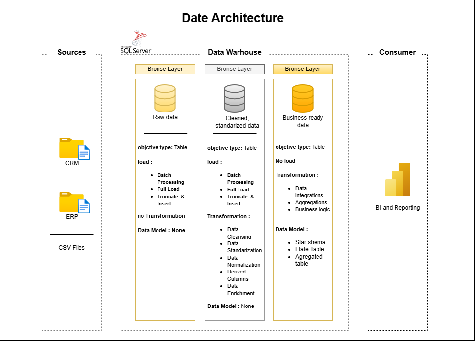
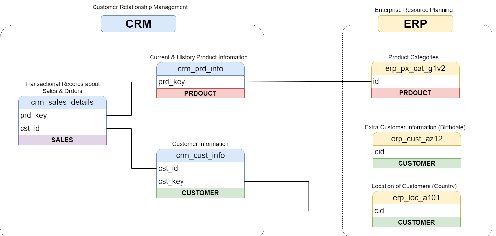

# 🏢 SQL Data Warehouse & Analytics Engine (Medallion Architecture)


-blue)


---

## 📌 Project Overview

This repository contains an end-to-end Data Warehouse and Business Intelligence solution developed using Microsoft SQL Server and modeled on the **Medallion Data Architecture** (Bronze $\rightarrow$ Silver $\rightarrow$ Gold). The data warehouse ingests raw source datasets, cleanses and standardizes records, transforms entities into a Star Schema, and serves analytical key performance indicators (KPIs) through dedicated SQL reporting views.

The pipeline handles database initialization, stored-procedure-based ETL extraction, data transformations, exploratory data analysis (EDA), advanced window-based time-series analytics, customer segmentation, and executive reporting views.

---

## 🏗️ Data Architecture & Pipeline
[ Source ERP & CRM Datasets ]
│
▼ (Bulk Ingestion / Raw Staging)
🥉 Bronze Layer (bronze.ddl_bronze, bronze.proc_load_bronze)
│
▼ (Data Cleansing, Deduplication, Standardization)
🥈 Silver Layer (silver.ddl_silver, silver.proc_load_silver)
│
▼ (Star Schema Modeling, Surrogate Keys, Conformed Dimensions)
🥇 Gold Layer   (gold.dim_customers, gold.dim_products, gold.fact_sales)
│
├──► 📊 Gold Reporting Views (gold.report_products, gold.report_customers)
└──► 📈 Advanced Analytics (YoY Performance, RFM Segmentation, Moving Averages)

---

## 🖼️ Architectural Diagrams & Data Models

### 1. Data Architecture Pipeline


### 2. Dimensional Star Schema Model


### 3. Source-to-Target Data Integration Workflow


### Technical Documentation Reference
* **Layer Architecture Details**: [`docs/data_layers.pdf`](docs/data_layers.pdf)
* **Data Dictionary & Schema Catalog**: [`docs/data_catalog.md`](docs/data_catalog.md)
* **Object Naming Standards**: [`docs/naming_conventions.md`](docs/naming_conventions.md)

---

## ⚙️ Project Requirements

### Database & Platform
* **Database Engine**: Microsoft SQL Server 2019+ or Azure SQL Database
* **Supported Client Tools**:
  * SQL Server Management Studio (SSMS) v19+
  * Azure Data Studio
  * Visual Studio Code (`mssql` extension)
* **Execution Permissions**: Bulk file ingestion rights (`ADMINISTER BULK OPERATIONS` / `BULK INSERT`) to load source datasets

### Medallion Schemas
* **`bronze`**: Raw staging schema designed for unmodified ingestion from file sources.
* **`silver`**: Cleansed schema containing standardized, deduplicated, and typed entity tables.
* **`gold`**: Star Schema presentation layer containing fact/dimension tables and user-facing reporting views.

---

## 📂 Repository Structure

```plaintext
├── datasets/                                 # Dimensional schemas & datasets
│   └── ddl_gold.sql                         # Gold star schema definitions
├── docs/                                     # Diagrams, specs & data catalogs
│   ├── data model.drawio.png                # Star schema ERD
│   ├── data_architecture.drawio.png         # Medallion data architecture
│   ├── data_catalog.md                      # Data catalog & column definitions
│   ├── data_integration.png                # Source-to-target integration workflow
│   ├── data_layers.pdf                      # Data layers reference guide
│   └── naming_conventions.md               # Object & column naming standards
├── scripts/                                  # Database ETL & DDL scripts
│   ├── init_database.sql                    # Database & schema creation
│   ├── bronze/
│   │   ├── ddl_bronze.sql                   # Bronze layer DDL
│   │   └── proc_load_bronze.sql             # Bronze bulk load stored procedure
│   └── silver/
│       ├── ddl_silver.sql                   # Silver layer DDL
│       └── proc_load_silver.sql             # Silver ETL transformation procedure
└── data analytics/                           # Analytics & BI SQL scripts
    ├── Exploratory data analysis/
    │   ├── 01_database_exploration.sql      # Schema metadata inspection
    │   ├── 02_dimensions_exploration.sql    # Categorical & geographic profiling
    │   ├── 03_date_range_exploration.sql    # Temporal boundaries & age ranges
    │   ├── 04_measures_exploration.sql      # Top-line measures & executive KPI sheet
    │   ├── 05_magnitude_analysis.sql        # Revenue & customer magnitude breakdowns
    │   └── 06_ranking_analysis.sql          # Top/bottom rankings (TOP, RANK)
    ├── Advance analytics/
    │   ├── 07_change_over_time_analysis.sql # Time-series & date grouping
    │   ├── 08_cumulative_analysis.sql       # Running totals & moving averages
    │   ├── 09_performance_analysis.sql      # YoY shifts & historical variance
    │   ├── 10_data_segmentation.sql         # Cost tiers & customer VIP/Regular segments
    │   └── 11_part_to_whole_analysis.sql    # Proportional sales contribution (% of total)
    └── Reporting/
        ├── Report_customers.sql             # Customer behavioral reporting view
        └── Report_products.sql              # Product performance reporting view
```

📊 Analytics & Reporting Capabilities
1. Exploratory Data Analysis (EDA)
Metadata & Dimensions: Validates schema definitions using INFORMATION_SCHEMA and audits unique categories and geographic territories[cite: 1].

Time Horizons & Demographics: Detects temporal boundaries (MIN/MAX dates) and demographic ranges (youngest vs. oldest customer profiles)[cite: 1].

Measures & Magnitude: Aggregates gross revenue, total physical units sold, distinct orders, and registered vs. purchasing customer accounts[cite: 1].

Ranking: Evaluates top-performing products and high-value customer accounts using window functions (RANK() OVER (...)) and TOP clauses[cite: 1].

2. Advanced Analytics Suite
Time-Series Analysis: Tracks revenue trends and seasonality over chronological intervals using DATETRUNC(), DATEPART(), and FORMAT()[cite: 1].

Cumulative Computations: Calculates progressive running sales totals and baseline moving price averages using SUM() OVER (ORDER BY ...)[cite: 1].

Performance Benchmarking: Analyzes Year-over-Year (YoY) revenue changes using LAG() and benchmarks yearly sales against product historical baselines[cite: 1].

Entity Segmentation: Classifies product catalog items into cost bands and assigns customers into VIP, Regular, and New loyalty tiers based on tenure and lifetime spend[cite: 1].

Part-to-Whole Share: Evaluates category-level revenue contributions as a percentage of total enterprise sales using SUM() OVER ()[cite: 1].

3. Business Reporting Views (gold.report_*)
gold.report_products: Consolidates orders, units sold, total revenue, product lifespan, recency in months, performance tiering (High-Performer, Mid-Range, Low-Performer), Average Order Revenue (AOR), and average monthly revenue[cite: 1].

gold.report_customers: Consolidates customer lifespan, demographic age brackets, loyalty tiers (VIP, Regular, New), purchase recency, Average Order Value (AOV), and average monthly spend[cite: 1].


🛡️ Engineering & Quality Standards
Idempotent Deployments: All DDL and view scripts include conditional existence checks (IF OBJECT_ID(...) IS NOT NULL DROP...) for clean repeatability[cite: 1].

Defensive Arithmetic: Calculation ratios (such as AOV, monthly spend velocity, and growth rates) protect against division-by-zero errors through conditional checks.

Modular Codebase: Transformation procedures and DDL scripts are decoupled across the Bronze, Silver, and Gold schemas to enforce clear separation of concerns[cite: 1].
